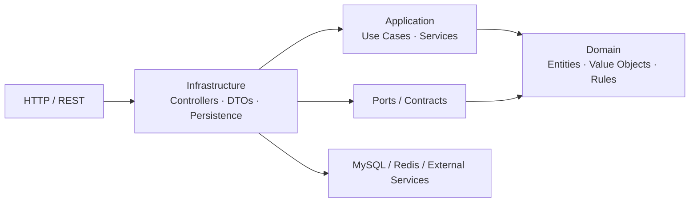
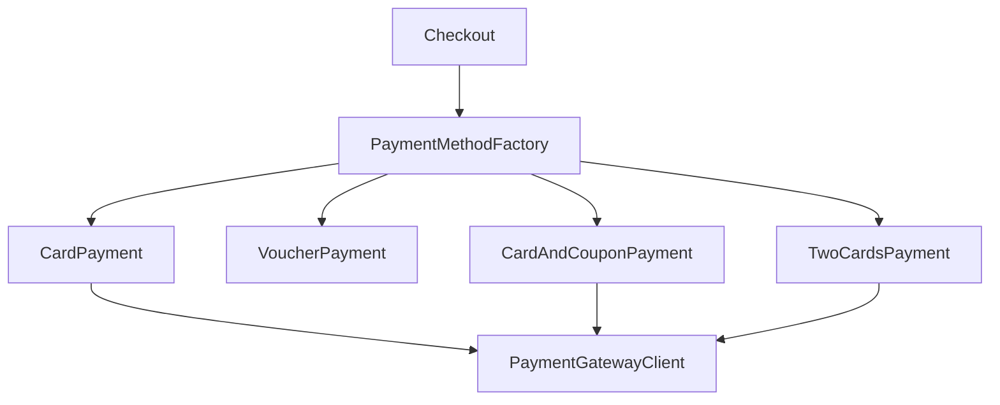
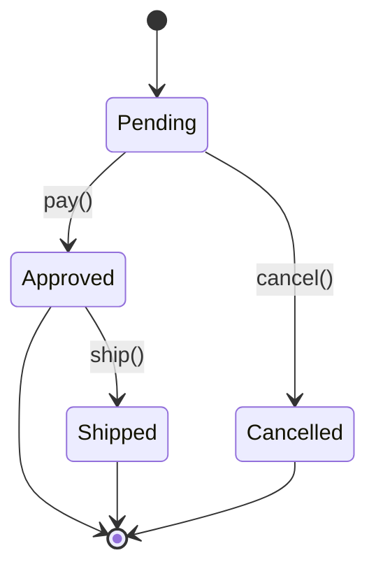
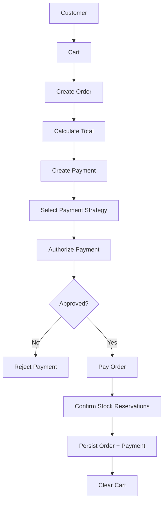
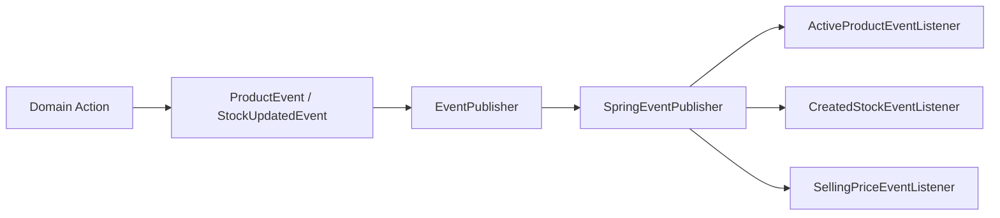
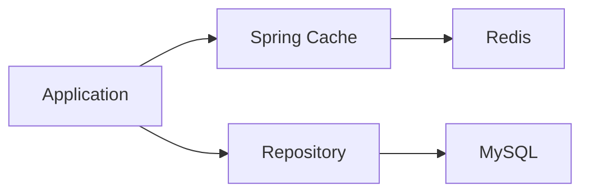

<div align="center">

# 🛒 Clean Ecommerce

### A domain-driven e-commerce API built to explore software architecture in practice.

[](https://www.oracle.com/java/)
[](https://spring.io/projects/spring-boot)
[](https://www.mysql.com/)
[](https://redis.io/)
[](https://www.docker.com/)

**Clean Architecture · DDD · SOLID · Object Calisthenics · OOP**

</div>

---

## 🎯 About the Project

**Clean Ecommerce** is a complete e-commerce backend developed in Java and Spring Boot.

The project was created as a practical laboratory for applying software engineering principles to a real-world domain rather than treating the application as a collection of CRUD endpoints.

The main goals are:

- model business rules explicitly;
- keep the domain independent from infrastructure;
- reduce coupling between business modules;
- make use cases easy to test;
- apply object-oriented design principles;
- explore design patterns where they provide real value;
- experiment with authentication, caching and observability.

> **The goal is not only to make the system work. The goal is to make the system easier to understand, test and evolve.**

---

# 🏗️ Architecture

The codebase is organized primarily by **business capability**, with each major module separating application, domain and infrastructure concerns.

```text
com.cleancode.ecommerce
│
├── adm
├── cart
├── customer
├── event
├── order
├── payment
├── product
├── promotional
├── stock
├── user
└── shared
```

Inside the business modules, the recurring structure is:

```text
module/
│
├── application/
│   ├── dto
│   ├── service
│   └── usecase
│
├── domain/
│   ├── entities
│   ├── value objects
│   ├── repository contracts
│   └── business rules
│
└── infra/
    ├── config
    ├── controller
    ├── gateway
    ├── mapper
    └── persistence
```

### Dependency direction



The architectural intent is to keep the **domain at the center**, while infrastructure details remain replaceable implementation concerns.

---

# 🧩 Business Modules

| Module | Responsibility |
|---|---|
| `customer` | Customer registration, profile, addresses and cards |
| `product` | Product creation, activation, pricing and catalog |
| `cart` | Shopping cart and product reservations |
| `stock` | Stock availability, reservations and confirmations |
| `order` | Order creation and lifecycle |
| `payment` | Payment orchestration and payment strategies |
| `promotional` | Vouchers and discounts |
| `adm` | Administrative operations |
| `user` | Authentication and user access |
| `event` | Application/domain event publishing |
| `shared` | Shared kernel, value objects, exceptions and cross-cutting infrastructure |

---

# 🧠 Domain Modeling

A major goal of the project is to represent business concepts explicitly instead of passing primitive values throughout the system.

Examples of domain/value objects include:

```text
Email
Cpf
Name
Password
Price
ProductId
OrderId
CustomerId
PaymentId
ReservationId
StockId
VoucherId
```

This allows concepts with business meaning to encapsulate their own validation and behavior.

For example:

```text
String email
```

becomes a domain concept:

```text
Email
```

The same idea is applied to prices, identifiers and other business concepts.

---

# 💳 Payment Design

The payment module demonstrates the use of **Strategy + Factory + Dependency Inversion**.

Supported payment strategies include:

```text
Card
Voucher
Card + Voucher
Two Cards
```

The application depends on the abstraction:

```text
PaymentMethod
```

and the factory selects the appropriate implementation:



This means adding another payment strategy can be done without turning the checkout service into a large conditional block.

---

# 📦 Order State Machine

The order lifecycle is modeled using the **State Pattern**.



The state itself controls which operations are valid.

Examples:

- a pending order can be paid;
- a pending order cannot be shipped;
- an approved order cannot be paid again;
- a shipped order cannot be cancelled;
- a shipped order cannot be shipped again.

This keeps lifecycle rules close to the domain object instead of spreading them across controllers and services.

---

# 🛍️ Checkout Flow

The checkout application service coordinates several domain modules.



The checkout flow coordinates the transaction, while the individual business rules remain in their respective modules.

---

# 📦 Stock & Reservations

The stock module models product availability and reservations.

```text
Available Stock
      │
      ▼
Reservation
      │
      ├── Cart
      │
      ├── Checkout
      │
      └── Confirmation
             │
             ▼
        Stock Output
```

The `Stock` domain acts as the consistency boundary for stock operations, while repositories abstract persistence.

---

# 📡 Events

The project also contains an event mechanism used for product/stock-related reactions.



The purpose is to reduce direct coupling between the operation that produces an event and the components that react to it.

---

# 🔐 Security

Authentication and authorization are implemented with:

- Spring Security
- JWT
- BCrypt password hashing
- Stateless sessions
- Role-based access control

The security configuration exposes protected areas according to roles, for example:

```text
/adm/**       → ROLE_ADM
/customer/**  → ROLE_CUSTOMER or ROLE_ADM
```

The JWT request flow is approximately:

```text
HTTP Request
     │
     ▼
Bearer Token
     │
     ▼
JwtAuthFilter
     │
     ▼
Token Validation
     │
     ▼
UserDetailsService
     │
     ▼
SecurityContext
     │
     ▼
Protected Endpoint
```

---

# 💾 Persistence

Persistence uses:

- Spring Data JPA
- Hibernate
- MySQL 8
- Flyway migrations

The database schema is versioned through migrations located under:

```text
src/main/resources/db/migration
```

The project currently contains migrations covering customers, addresses, products, carts, stock, cards, vouchers, payments and orders.

The domain does not directly depend on JPA entities. Mappers and gateway implementations handle the translation between domain and persistence representations.

---

# ⚡ Redis & Caching

Redis is used through:

- Spring Data Redis
- Spring Cache
- Lettuce

The architecture separates caching infrastructure from domain logic.



This gives the project a practical environment for experimenting with cache-backed reads and performance.

---

# 📊 Observability

Observability is part of the local infrastructure.

```text
Spring Boot
    │
    ▼
Actuator
    │
    ▼
Micrometer
    │
    ▼
Prometheus
    │
    ▼
Grafana
```

The Docker environment also contains exporters for:

- MySQL
- Redis
- Host metrics

Exposed application endpoints include health, metrics and Prometheus metrics.

---

# 🧪 Testing

The repository contains **55 Java test classes**.

Testing is supported by:

- JUnit
- Spring Boot Test
- Playwright
- JaCoCo

JaCoCo is configured through Maven to generate coverage information during the verification phase.

The tests focus particularly on domain behavior, application use cases and integration-oriented behavior.

---

# 🐳 Local Infrastructure

Docker Compose provides the development infrastructure:

```text
┌─────────────────────────────────────────┐
│              Docker Compose             │
│                                         │
│  MySQL 8        Redis 7                  │
│  Adminer        Prometheus               │
│  Grafana        Node Exporter            │
│  MySQL Exporter Redis Exporter           │
│                                         │
└─────────────────────────────────────────┘
```

## Services

| Service | Port |
|---|---:|
| MySQL | `3307` |
| Redis | `6379` |
| Prometheus | `9090` |
| Grafana | `3000` |
| Adminer | `8085` |
| Node Exporter | `9100` |
| MySQL Exporter | `9104` |
| Redis Exporter | `9121` |

---

# 🚀 Running Locally

## Requirements

- Java 25
- Maven Wrapper
- Docker
- Docker Compose

## 1. Start infrastructure

```bash
docker compose up -d
```

## 2. Run the application

Linux/macOS:

```bash
./mvnw spring-boot:run
```

Windows:

```bash
mvnw.cmd spring-boot:run
```

## 3. Run tests

```bash
./mvnw test
```

## 4. Generate coverage

```bash
./mvnw verify
```

The JaCoCo report is generated under:

```text
target/site/jacoco/
```

---

# 📖 API Documentation

The project uses SpringDoc OpenAPI.

After starting the application, Swagger UI is available at:

```text
http://localhost:8080/swagger-ui/index.html
```

OpenAPI JSON:

```text
http://localhost:8080/v3/api-docs
```

---

# 🧱 Engineering Principles

## Clean Architecture

The system separates business rules from technical details.

## Domain-Driven Design

The code is organized around business concepts and domain behavior.

## SOLID

The project applies the principles of:

- Single Responsibility
- Open/Closed
- Liskov Substitution
- Interface Segregation
- Dependency Inversion

## Object Calisthenics

The project intentionally explores practices such as:

- wrapping primitives in meaningful objects;
- avoiding unnecessary `else`;
- using intention-revealing names;
- protecting collections;
- reducing deep nesting;
- keeping behavior close to the object that owns the rule.

---

# 🎨 Design Patterns Used

| Pattern | Example |
|---|---|
| **Strategy** | Payment methods |
| **Factory** | `PaymentMethodFactory` |
| **State** | Order lifecycle |
| **Repository** | Domain persistence contracts |
| **Gateway** | Infrastructure implementations |
| **Mapper** | Domain ↔ persistence conversion |
| **Domain Events** | Product/stock reactions |
| **Dependency Injection** | Application and infrastructure composition |
| **Shared Kernel** | Common domain concepts and value objects |

Patterns are used as tools to solve specific design problems, not simply to increase the number of patterns in the codebase.

---

# 🔎 Architecture Decisions

### 1. Organize by business capability

Instead of a global structure such as:

```text
controllers/
services/
repositories/
entities/
```

the project groups code by domain:

```text
customer/
product/
cart/
order/
payment/
stock/
```

This makes the relationship between the codebase and the business easier to navigate.

### 2. Keep domain contracts independent

Repositories and gateways are represented through abstractions so that the application and domain do not need to know the concrete persistence or external-service implementation.

### 3. Model business concepts explicitly

Value Objects such as `Email`, `Cpf`, `Price` and domain-specific identifiers make important concepts explicit and help protect invariants.

### 4. Keep business behavior inside the domain

Operations such as order transitions, product behavior and stock operations are represented as domain behavior instead of relying only on public setters.

### 5. Use application services as orchestrators

The application layer coordinates multiple domain capabilities without becoming the place where every business rule is implemented.

---

# 📌 Project Status

This project is an evolving engineering laboratory.

New features, refactorings and architectural experiments are added as part of the learning process.

The focus is continuous improvement:

```text
Learn
  ↓
Design
  ↓
Implement
  ↓
Test
  ↓
Observe
  ↓
Refactor
  ↓
Repeat
```

---

# 👨‍💻 Author

<div align="center">

### Kleberson Santos

**Software Engineer**

[](https://github.com/softwarekleberson)
[](http://linkedin.com/in/klebersondossantossilva01)

> **"Subindo no ombro de gigantes."**

</div>
