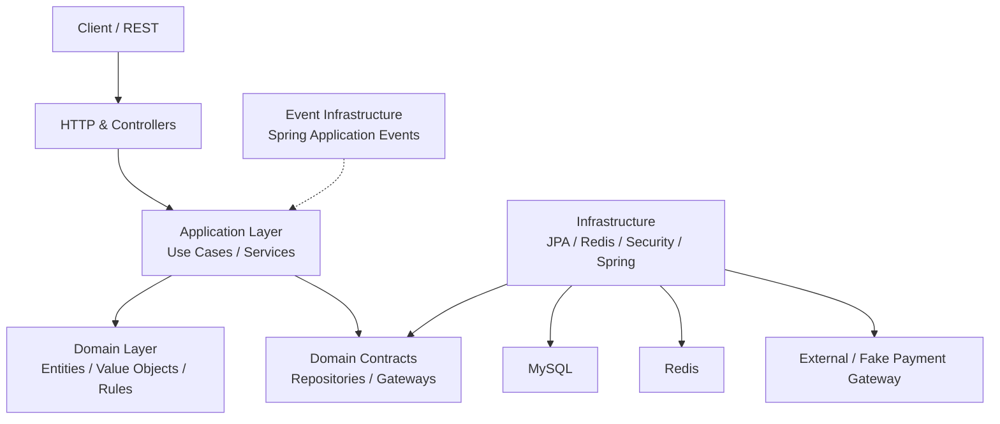
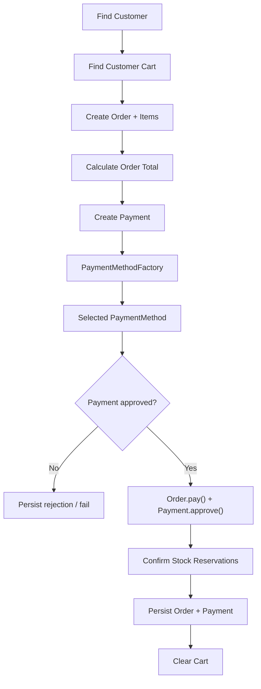
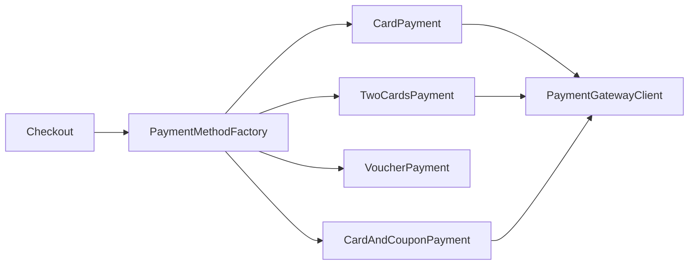
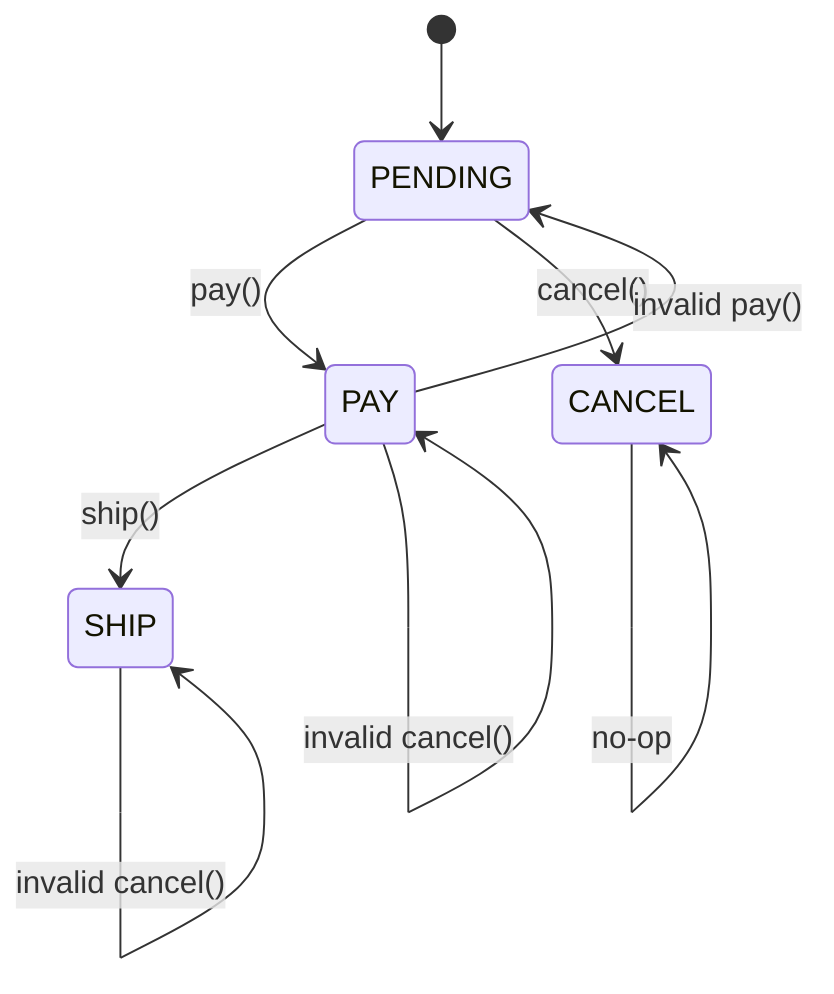

# Architecture

## 1. Overview

Clean Ecommerce is a Java/Spring Boot e-commerce backend organized around business capabilities. The current implementation combines Clean Architecture principles with domain-oriented modularization, explicit domain objects, dependency inversion, and selected design patterns.

The architectural objective is to keep business rules understandable and relatively independent from delivery, persistence and infrastructure concerns.

> This document describes the architecture as implemented in the current codebase. It is documentation of the existing system, not a claim that every boundary is already perfect.

---

## 2. High-Level View



The intended dependency direction is:

```text
Delivery / Infrastructure
          ↓
     Application
          ↓
       Domain
```

Infrastructure implements contracts consumed by the inner layers rather than forcing domain code to depend directly on JPA, Redis or HTTP.

---

## 3. Business Modules

The codebase is organized primarily by business capability:

```text
com.cleancode.ecommerce
├── adm
├── cart
├── customer
├── event
├── order
├── payment
├── product
├── promotional
├── stock
├── user
└── shared
```

The most relevant domain responsibilities are:

| Module | Responsibility |
|---|---|
| `customer` | Customer, contacts, addresses and cards |
| `product` | Products, pricing and activation |
| `cart` | Cart items and reservations |
| `stock` | Stock, inputs, outputs and reservations |
| `order` | Orders, items and lifecycle |
| `payment` | Payment orchestration and payment strategies |
| `promotional` | Vouchers and discounts |
| `user` | Authentication-facing user model |
| `adm` | Administrative operations |
| `event` | Application event publishing/listeners |
| `shared` | Shared kernel, security, Redis, errors and cross-cutting utilities |

---

## 4. Internal Module Structure

Most business modules follow a three-part structure:

```text
module/
├── application/
│   ├── dto(s)
│   ├── service
│   └── usecase
│
├── domain/
│   ├── entities / aggregates
│   ├── value objects
│   ├── repository contracts
│   └── domain exceptions
│
└── infra/
    ├── controller
    ├── gateway
    ├── mapper
    ├── persistence
    └── config
```

There are small variations between modules, but the architectural intent remains consistent.

---

## 5. Domain Model

The project uses explicit domain types instead of relying exclusively on primitives.

Examples from the shared kernel include:

```text
Email
Cpf
Name
Password
Price
ProductId
OrderId
CustomerId
PaymentId
StockId
VoucherId
ReservationId
CartId
```

This approach gives important business concepts a place for validation, invariants and semantic meaning.

### Example

Instead of spreading `String` values for every identifier or email throughout the application, the code can represent those concepts as domain types.

This is one of the mechanisms used to support the project's DDD and Object Calisthenics goals.

---

## 6. Dependency Inversion

Repositories are defined as contracts in domain packages and implemented in infrastructure.

Examples:

```text
customer.domain.customer.repository.CustomerRepository
cart.domain.repository.CartRepository
order.domain.repository.OrderRepository
payment.domain.repository.PaymentRepository
product.domain.repository.ProductRepository
promotional.domain.repository.VoucherRepository
stock.domain.repository.StockRepository
```

The implementation is placed under infrastructure, for example:

```text
CustomerRepositoryJpa
CartRepositoryJpa
OrderRepositoryJpa
PaymentRepositoryJpa
ProductRepositoryJpa
VoucherRepositoryJpa
StockRepositoryJpa
```

Conceptually:

```text
Domain
  │
  ▼
Repository Contract
  ▲
  │
Infrastructure Adapter
  │
  ▼
JPA / Hibernate / MySQL
```

---

## 7. Checkout Use Case

`CheckoutImpl` is an application service that orchestrates several business capabilities.

The current flow is approximately:



The application layer coordinates the workflow while payment-specific rules and order-state rules remain in their respective objects.

---

## 8. Payment Strategy + Factory

Payment methods implement a common contract:

```text
PaymentMethod
├── CardPayment
├── TwoCardsPayment
├── VoucherPayment
└── CardAndCouponPayment
```

`PaymentMethodFactoryImpl` indexes available strategies by `TypePayment` and returns the appropriate implementation.



This keeps payment selection out of `CheckoutImpl` and makes individual payment algorithms independently testable.

---

## 9. Order State

The order aggregate delegates lifecycle operations to an `OrderState` implementation.

Current state objects:

```text
PendingState
ApprovedState
ShipState
CancelState
```

Current transitions implemented in the domain:



The important architectural decision is that invalid transitions are rejected by the domain state instead of being implemented as scattered status checks in controllers.

---

## 10. Events

The `event` package provides an abstraction over event publication:

```text
EventPublisher
      │
      ▼
SpringEventPublisher
      │
      ▼
ApplicationEventPublisher
      │
      ├── ActiveProductEventListener
      ├── CreatedStockEventListener
      └── SellingPriceEventListener
```

The current event mechanism is in-process and based on Spring application events. It is therefore useful for decoupling reactions inside the application, but it is **not a distributed message broker architecture**.

---

## 11. Persistence

Persistence uses:

- Spring Data JPA
- Hibernate
- MySQL
- Flyway

The persistence representation is separated from domain representation through persistence entities and mapper classes.

```text
Domain Object
      │
      ▼
   Mapper
      │
      ▼
JPA Entity
      │
      ▼
Hibernate
      │
      ▼
MySQL
```

---

## 12. Security Boundary

Security is implemented in the shared infrastructure layer with:

```text
Spring Security
JWT
JwtAuthFilter
JwtService
CustomUserDetailsService
BCrypt password encoder
```

Authentication concerns are therefore kept outside the core domain model.

---

## 13. Caching and Observability

### Cache

The application uses Spring Cache and Redis:

```text
Application
    │
    ▼
Spring Cache
    │
    ▼
Redis
```

### Observability

The project uses Spring Boot Actuator and Micrometer Prometheus registry. The Docker environment also provides Prometheus, Grafana and exporters.

```text
Spring Boot
    │
    ▼
Actuator / Micrometer
    │
    ▼
Prometheus
    │
    ▼
Grafana
```

---

## 14. Architectural Trade-offs

This architecture deliberately accepts some complexity in exchange for clearer business boundaries.

### Benefits

- Business rules are easier to locate.
- Infrastructure can be replaced behind contracts.
- Domain behavior is explicit.
- Use cases are easier to test independently.
- Design patterns are localized to the problems they solve.

### Costs

- More classes and packages than a simple layered CRUD application.
- More mapping code between domain and persistence.
- More upfront modeling effort.
- Developers need to understand the dependency direction and module boundaries.

The project therefore favors **long-term maintainability and learning about architecture** over minimizing the number of files.

---

## 15. Known Technical Debt

The architecture documentation should not hide current limitations.

Examples visible in the current codebase include:

- some naming inconsistencies (`Prouct`, `persistence/persistencia`, etc.);
- some duplicated/legacy concepts, such as `StatusOrder` alongside `OrderStatus`;
- at least one unfinished method (`Order.addOrderItem` contains a TODO);
- some domain/application responsibilities can still be refined;
- the payment gateway is currently represented by an application abstraction and a fake implementation for local development;
- the event mechanism is in-process rather than distributed.

Documenting these limitations makes the architecture discussion more credible: the project is an evolving engineering laboratory, not a claim of architectural perfection.

---

## 16. Related ADRs

- [ADR-0001 — Organize code by business capability](adr/0001-organize-by-business-capability.md)
- [ADR-0002 — Separate application, domain and infrastructure](adr/0002-separate-application-domain-infrastructure.md)
- [ADR-0003 — Use explicit domain types and Value Objects](adr/0003-explicit-domain-types-and-value-objects.md)
- [ADR-0004 — Model order lifecycle with State](adr/0004-order-lifecycle-state-pattern.md)
- [ADR-0005 — Select payment behavior with Strategy + Factory](adr/0005-payment-strategy-and-factory.md)
- [ADR-0006 — Use repository/gateway contracts for dependency inversion](adr/0006-repository-and-gateway-contracts.md)
- [ADR-0007 — Use in-process application events](adr/0007-in-process-domain-events.md)

---
